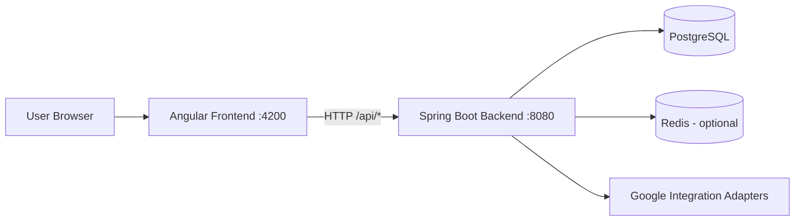
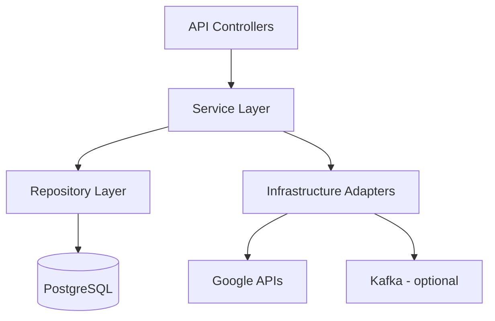
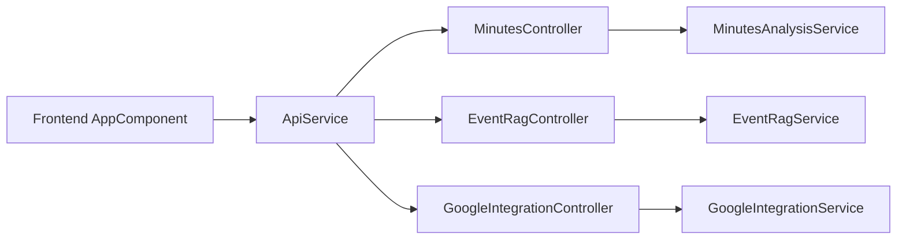
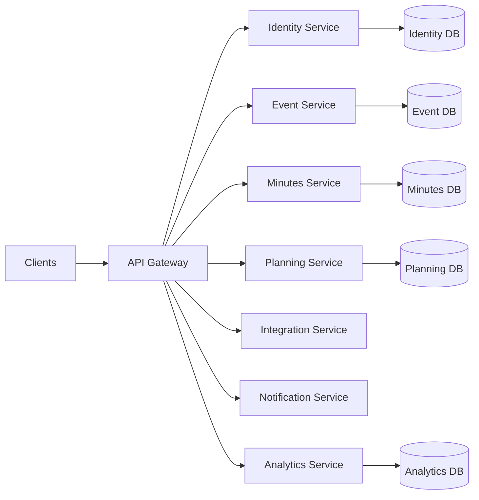
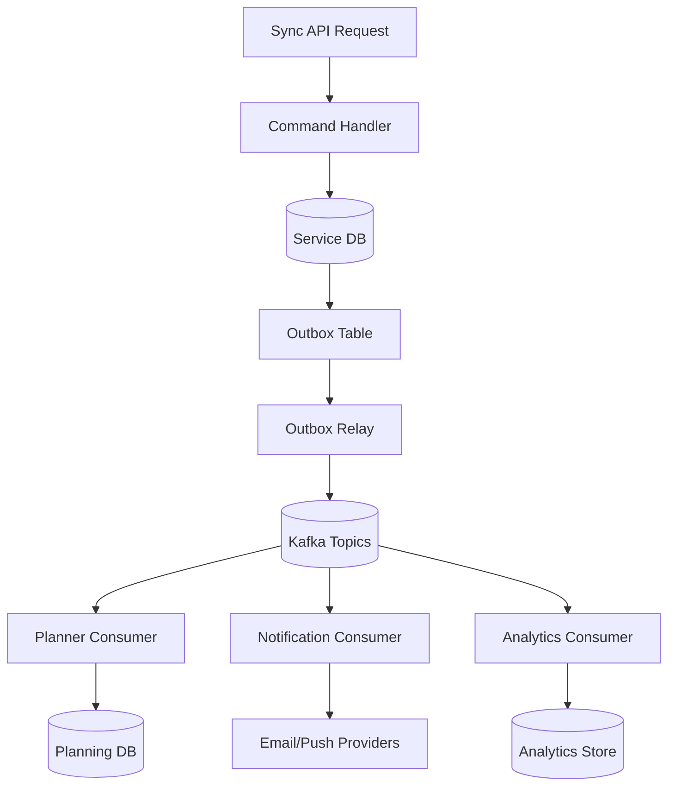
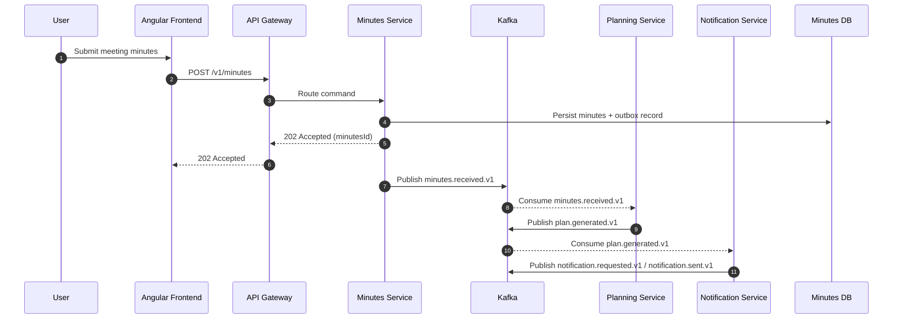
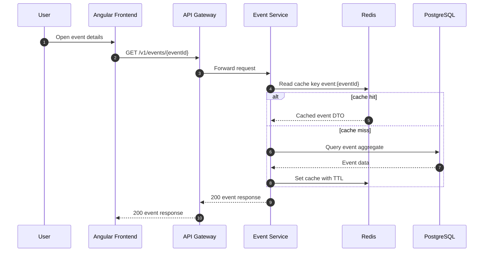

# Build Plan and System Architecture

## 1. Purpose
This document defines a practical build plan and the current system architecture for the UM Event Management project.

Project scope:
- Backend: Spring Boot application (`backend`) exposing REST APIs
- Frontend: Angular application (`frontend`) consuming backend APIs
- Data and integration layers: PostgreSQL, Flyway, optional Redis, optional Google integration adapters

## 2. Technology Baseline
- Java: 17 (from `backend/pom.xml`)
- Maven: 3.9+ (recommended)
- Node.js: 20 LTS (recommended)
- npm: 10+
- Angular: 18 (`frontend/package.json`)
- Backend port: 8080 (`backend/src/main/resources/application.yml`)
- Frontend port: 4200 (`frontend/package.json`)

## 3. Build Plan

### 3.1 Build Objectives
- Ensure both applications compile and test successfully.
- Keep the frontend and backend contract stable.
- Produce deployable artifacts (`.jar` and frontend static bundle).

### 3.2 Local Development Build Plan

1. Verify prerequisites
- Confirm Java and Maven:
  - `java -version`
  - `mvn -version`
- Confirm Node and npm:
  - `node -v`
  - `npm -v`

2. Build and run backend
- `cd backend`
- `mvn clean test`
- `mvn spring-boot:run`
- Expected result: backend available at `http://localhost:8080`

3. Build and run frontend
- In a new terminal:
- `cd frontend`
- `npm install`
- `npm run build`
- `npm start`
- Expected result: frontend available at `http://localhost:4200`

4. Smoke test integration
- Open frontend UI and verify feature pages can call backend endpoints.
- Confirm CORS allows frontend origin (`http://localhost:4200`) for `/api/**` paths.

### 3.3 Packaging Plan (Release Build)

1. Backend release artifact
- `cd backend`
- `mvn clean package -DskipTests`
- Output: executable JAR in `backend/target/`

2. Frontend release artifact
- `cd frontend`
- `npm ci`
- `npm run build`
- Output: production assets in `frontend/dist/`

3. Release validation checklist
- Backend health endpoints reachable (`/actuator/health`)
- API docs endpoint accessible (SpringDoc)
- Frontend build has no TypeScript or Angular compile errors

### 3.4 Suggested CI Pipeline Plan

Stage 1: Backend Verify
- Checkout code
- Set Java 17
- Run `mvn -f backend/pom.xml clean verify`

Stage 2: Frontend Verify
- Set Node 20
- Run `npm ci --prefix frontend`
- Run `npm run build --prefix frontend`
- Run `npm test --prefix frontend -- --watch=false --browsers=ChromeHeadless` (if headless browser available)

Stage 3: Artifact Publication
- Archive `backend/target/*.jar`
- Archive `frontend/dist/**`

Stage 4: Deployment Gate
- Deploy only when both stages pass
- Run post-deploy smoke checks

## 4. System Architecture

### 4.1 High-Level Architecture
The system follows a two-tier web architecture:
- Angular SPA as the presentation layer
- Spring Boot REST API as the application layer
- PostgreSQL as the primary persistent data store
- Flyway for database schema migration lifecycle



### 4.2 Backend Internal Architecture
Backend package layout is feature-oriented with shared core and infrastructure modules.

Core areas:
- `features/auth`: authentication and authorization functionality
- `features/event`: event planning and RAG-related APIs/services
- `features/minutes`: meeting-minutes analysis workflows
- `features/user`: user domain functionality
- `core/security`: security filters and auth support
- `infrastructure/google`: external Google adapters
- `infrastructure/kafka`: event/messaging integration points



### 4.3 Frontend Architecture
Frontend uses Angular standalone architecture and feature modules under `src/app/features`.

Key aspects:
- Central API client (`src/app/core/api/api.service.ts`)
- Feature folders:
  - `dashboard`
  - `minutes`
  - `rag`
  - `integrations`
- API base URL currently points to `http://localhost:8080/api`

### 4.4 Runtime Data Flow

1. User interacts with Angular page.
2. Angular calls backend endpoint via `ApiService`.
3. Controller routes request to service logic.
4. Service reads/writes persistent data through repositories.
5. Service optionally calls integration adapters (Google/Kafka).
6. Response is returned to Angular and rendered in UI.

### 4.5 Current System Core Modules and Features
This section describes what is implemented now in the current codebase, and what is scaffolded for future growth.

#### 4.5.1 Backend Core Modules (Current State)

| Module | Path | Responsibility | Current Status |
|---|---|---|---|
| Bootstrap | `backend/src/main/java/com/umevent/management/ManagementApplication.java` | Spring Boot entrypoint and application startup | Implemented |
| Configuration | `backend/src/main/java/com/umevent/management/config` | Runtime web configuration (CORS policy for API access) | Implemented |
| Common | `backend/src/main/java/com/umevent/management/common` | Shared constants, exceptions, utilities | Scaffolded folders (minimal active code) |
| Core Security | `backend/src/main/java/com/umevent/management/core/security` | Security domain (auth filters/rules) | Scaffolded folder |
| Infrastructure Google | `backend/src/main/java/com/umevent/management/infrastructure/google` | External integration adapter for Drive and Gmail retrieval | Implemented (placeholder/demo retrieval) |
| Infrastructure Kafka | `backend/src/main/java/com/umevent/management/infrastructure/kafka` | Messaging integration boundary | Scaffolded folder |

#### 4.5.2 Backend Feature Modules (Current State)

| Feature | Package | Responsibility | Endpoints | Status |
|---|---|---|---|---|
| Minutes Analysis | `features/minutes` | Parse minutes text, extract action items, persist in-memory records | `POST /api/ai/minutes/analyze`, `GET /api/ai/minutes` | Implemented |
| Event RAG Planning | `features/event` | Retrieve historical event patterns and generate next-action plans | `GET /api/events/rag/patterns`, `POST /api/events/rag/plan` | Implemented |
| Google Integration | `infrastructure/google` | Retrieve Drive/Gmail event-related records | `GET /api/google/drive-items`, `GET /api/google/gmail-events` | Implemented |
| Committee Member Performance | `features/analytics` (target) | Compute participation, completion, quality, and timeliness scores per member | `GET /v1/analytics/members/{memberId}/performance` (target) | Planned |
| Department Evaluation | `features/analytics` (target) | Evaluate department-level effectiveness, delivery quality, and SLA adherence | `GET /v1/analytics/departments/{departmentId}/evaluation` (target) | Planned |
| Auth | `features/auth` | Authentication and authorization | N/A | Scaffolded folder |
| User | `features/user` | User profile and user domain logic | N/A | Scaffolded folder |

#### 4.5.3 Frontend Core and Feature Mapping (Current State)

| Module | Path | Responsibility | Status |
|---|---|---|---|
| Root UI and orchestration | `frontend/src/app/app.component.ts` | Hosts all three feature workflows and binds to API calls | Implemented |
| API client core | `frontend/src/app/core/api/api.service.ts` | Centralized HTTP client for backend endpoints | Implemented |
| Feature folders | `frontend/src/app/features/*` | Intended split by dashboard/minutes/rag/integrations | Scaffolded folders (currently empty) |

Current frontend behavior:
- The app currently renders a single, consolidated workbench UI with three feature panels:
  - AI task tracking from minutes
  - Annual event RAG plan generation
  - Google Drive and Gmail retrieval
- This behavior is implemented in `app.component.*` and can later be refactored into the `features/*` folder structure.

Planned frontend panels to add:
- Committee member performance dashboard:
  - individual score trend, workload balance, completion rate, on-time rate
- Department evaluation dashboard:
  - department scorecards, cross-department comparison, risk heatmap, monthly trend

#### 4.5.4 Feature-to-Module Dependency Map



### 4.6 Target-State Microservices Architecture (Scale-Out)
For high throughput requirements, evolve from current modular monolith to bounded-context microservices.

Proposed service boundaries:
- `api-gateway`: routing, auth token validation, rate limiting, request shaping
- `identity-service`: user identity, auth, roles, JWT lifecycle
- `event-service`: event lifecycle, schedules, ownership, metadata
- `minutes-service`: minutes ingestion, parsing workflow, task extraction
- `planning-service`: RAG plan generation and recommendation orchestration
- `integration-service`: Google APIs, external connectors, webhook handling
- `notification-service`: email/push/queue-based notifications
- `analytics-service`: aggregation, reporting, KPI and operational metrics APIs

Data ownership model:
- One primary database schema per service (database-per-service pattern preferred)
- Shared-nothing writes across service boundaries
- Cross-service reads through APIs/events/materialized views



### 4.7 Event-Driven Architecture
Use asynchronous messaging for decoupling, burst absorption, and resilient retries.

Recommended event backbone:
- Kafka (or equivalent managed event streaming)
- Topic partitions sized by traffic and key cardinality
- Consumer groups per service concern

Core event topics:
- `minutes.received.v1`
- `minutes.processed.v1`
- `tasks.extracted.v1`
- `event.created.v1`
- `event.updated.v1`
- `plan.generated.v1`
- `notification.requested.v1`

Event design standards:
- Include `eventId`, `eventType`, `eventVersion`, `occurredAt`, `tenantId`, `traceId`
- Use immutable payloads and versioned schemas
- Use idempotency keys for at-least-once delivery safety
- Prefer outbox pattern for DB + event publish consistency



### 4.8 High QPS/TPS Capacity Strategy

Traffic model:
- QPS: request rate at ingress/API gateway
- TPS: committed transactional writes (DB + event publish)
- Design for p95 and p99 latency, not only average latency

Performance targets (example baseline to refine with load testing):
- Ingress target: 2,000 to 5,000 QPS sustained
- Transactional writes: 500 to 1,500 TPS sustained
- p95 API latency: less than 250 ms for read APIs
- p95 command latency: less than 500 ms for write APIs
- Error budget: less than 0.1 percent 5xx over rolling 30 days

Scaling levers:
- Horizontal pod autoscaling on CPU, memory, and queue lag
- Separate read and write workloads where needed
- Redis caching for hot reads and token/session checks
- DB connection pooling and query plan optimization
- Partition high-volume topics and tune consumer concurrency
- Backpressure and rate limiting at gateway

Data consistency model:
- Strong consistency inside a single service boundary
- Eventual consistency across services
- Sagas/process managers for long-running cross-service workflows

Hot path optimization guidance:
- Keep request handlers stateless
- Avoid synchronous fan-out to multiple services in one request
- Offload heavy work to async pipelines
- Use bulk/batch writes for analytics and non-critical projections

### 4.9 Reliability and Resilience Patterns
- Circuit breaker and timeout budgets per upstream call
- Retry with exponential backoff and jitter for transient faults
- Dead-letter topics for poison messages
- Idempotent consumers for duplicate delivery handling
- Multi-AZ deployment for critical services
- Graceful degradation for optional features (external integrations, analytics)

### 4.10 Observability for High Throughput
- Metrics: QPS, TPS, p95/p99 latency, saturation, queue lag, consumer lag
- Logs: structured JSON with trace and correlation IDs
- Traces: end-to-end OpenTelemetry tracing across gateway and services
- Dashboards: service health, dependency health, throughput, error budget
- Alerts: SLO burn-rate alerts (fast and slow burn windows)

### 4.11 Security and Multi-Tenant Considerations
- JWT validation at gateway and service-level authorization checks
- Tenant-aware partition keys and row-level isolation strategy
- Secret management via centralized vault service
- Audit event stream for privileged actions and configuration changes

## 5. Environment and Configuration Plan

### 5.1 Backend Profiles
- `application.yml` sets default profile `dev`.
- Profile-specific configs exist:
  - `application-dev.yml`
  - `application-prod.yml`

### 5.2 Required Runtime Variables (Examples)
- `GOOGLE_DRIVE_FOLDER_ID`
- `GOOGLE_GMAIL_QUERY`
- Database connection settings (for each profile)
- JWT secrets and security configuration values
- Kafka bootstrap servers and security config
- Redis endpoint and credentials
- OpenTelemetry exporter endpoint and sampling config

### 5.3 CORS and Port Contract
- Backend CORS allows `http://localhost:4200` for `/api/**`.
- Frontend should use backend base URL on port 8080.

## 6. Risks and Mitigations
- Java version mismatch risk:
  - README references Java 21 but `pom.xml` sets Java 17.
  - Mitigation: standardize on one version and update docs/build images.
- Environment drift risk:
  - Mitigation: pin Node and Java versions in CI.
- Integration dependency risk (Google/Kafka not always present):
  - Mitigation: keep adapters optional behind profile/feature flags.
- Throughput bottleneck risk at monolith DB and synchronous API chains:
  - Mitigation: introduce async event pipelines, service data ownership, and cache hot paths.
- Event ordering and duplication risk under high load:
  - Mitigation: partition by aggregate key, implement idempotent consumers, and use dead-letter handling.
- Noisy-neighbor risk in multi-tenant traffic:
  - Mitigation: tenant-aware rate limits, workload isolation, and per-tenant quotas.

## 7. Implementation Roadmap

Phase 1 (Stabilize)
- Align runtime versions (Java/Node) and documentation.
- Add CI checks for backend + frontend build.
- Add baseline performance tests and capture current QPS/TPS ceiling.

Phase 2 (Harden)
- Add integration tests for main API contracts.
- Add frontend environment files for API endpoint per environment.
- Introduce API gateway and distributed tracing.
- Add Redis cache for top read paths.

Phase 3 (Scale)
- Introduce containerized build/deploy flow.
- Add observability dashboards using Actuator + Prometheus metrics.
- Extract `minutes-service` and `planning-service` from monolith.
- Introduce Kafka topics and outbox relay pattern.

Phase 4 (Event-Driven Expansion)
- Add notification and analytics consumers.
- Implement saga/process managers for cross-service workflows.
- Establish schema registry and event versioning governance.

Phase 5 (High Throughput Readiness)
- Run capacity tests at target QPS/TPS with production-like data.
- Tune autoscaling, partition counts, and DB indexing strategy.
- Finalize SLOs, alert thresholds, and runbooks.

## 8. Build Plan for Microservices and Event-Driven Deployment

### 8.1 Build Topology
- One build pipeline per service repository or per service directory.
- One shared contract pipeline for API specs and event schemas.
- One integration pipeline for end-to-end event flow tests.

### 8.2 Pipeline Stages per Service
1. Static checks and unit tests
- Lint, test, and security scan dependencies.

2. Contract validation
- Validate OpenAPI and event schema compatibility.

3. Artifact build
- Build container image and publish with immutable tag.

4. Deploy to staging
- Progressive rollout (canary or blue/green).

5. Performance gate
- Validate p95 latency and error-rate thresholds under load.

6. Production promotion
- Promote only if service-level SLO checks pass.

### 8.3 Performance Validation Plan
- Load profiles: steady, burst, and soak tests
- Workload split: 70 percent reads, 30 percent writes (adjust with real traffic)
- Include queue lag and consumer catch-up time as acceptance criteria
- Fail deployment on SLO regression beyond defined threshold

## 9. Quick Command Reference

Backend:
- `cd backend`
- `mvn clean test`
- `mvn spring-boot:run`

Frontend:
- `cd frontend`
- `npm install`
- `npm run build`
- `npm start`

## 10. Service Contract Draft (APIs and Events)

### 10.1 Synchronous API Contract Draft
The following contracts are a target-state proposal for microservices extraction.

| Service | Endpoint | Method | Purpose | Request | Response |
|---|---|---|---|---|---|
| identity-service | `/v1/auth/login` | POST | Authenticate user | email, password | accessToken, refreshToken, expiresIn |
| identity-service | `/v1/auth/refresh` | POST | Refresh access token | refreshToken | accessToken, expiresIn |
| event-service | `/v1/events` | POST | Create event | eventName, department, date, metadata | eventId, status |
| event-service | `/v1/events/{eventId}` | GET | Get event details | path eventId | event aggregate |
| minutes-service | `/v1/minutes` | POST | Ingest minutes text | eventId, rawText, meetingDate | minutesId, processingStatus |
| minutes-service | `/v1/minutes/{minutesId}` | GET | Get minutes parsing state | path minutesId | parsed tasks, status |
| planning-service | `/v1/plans/generate` | POST | Generate event plan | eventId, currentMonth | planId, recommendedActions |
| planning-service | `/v1/plans/{planId}` | GET | Read generated plan | path planId | plan details |
| integration-service | `/v1/integrations/google/sync` | POST | Trigger Google sync | scope, accountRef | syncJobId, status |
| notification-service | `/v1/notifications/send` | POST | Send immediate notification | channel, recipients, payload | notificationId, status |
| analytics-service | `/v1/analytics/kpis` | GET | Query KPI dashboard data | filters, range | KPI aggregates |
| analytics-service | `/v1/analytics/members/{memberId}/performance` | GET | Query committee member performance scorecard | dateRange, eventId(optional) | weighted score, metric breakdown, trend |
| analytics-service | `/v1/analytics/departments/{departmentId}/evaluation` | GET | Query department evaluation report | dateRange, eventId(optional) | evaluation score, KPI breakdown, percentile |
| analytics-service | `/v1/analytics/departments/ranking` | GET | Compare departments in selected period | dateRange, dimension filters | ranked department list and deltas |

API standards:
- Idempotency required on all POST command endpoints via `Idempotency-Key` header.
- Correlation required via `X-Correlation-Id` header.
- Pagination required for list endpoints (`page`, `size`, `sort`).
- Error contract follows RFC 7807 (`application/problem+json`).

### 10.2 Event Contract Draft

Common envelope fields:
- `eventId` (UUID)
- `eventType` (string)
- `eventVersion` (integer)
- `occurredAt` (ISO timestamp)
- `tenantId` (string)
- `traceId` (string)
- `producer` (service name)
- `payload` (object)

Topic to event mapping:
- `minutes.received.v1`: emitted after minutes ingestion
- `minutes.processed.v1`: emitted after parsing and extraction complete
- `tasks.extracted.v1`: emitted when actionable tasks are identified
- `event.created.v1`: emitted on event creation
- `event.updated.v1`: emitted on event updates
- `plan.generated.v1`: emitted when planning-service finishes a plan
- `notification.requested.v1`: emitted when notifications should be sent asynchronously
- `member.performance.scored.v1`: emitted when member score computation completes
- `department.evaluated.v1`: emitted when department evaluation aggregate is refreshed

Example event payload (`minutes.processed.v1`):

```json
{
  "eventId": "4d7a2b8e-7a62-4bc0-a243-55fb85f9df2f",
  "eventType": "minutes.processed",
  "eventVersion": 1,
  "occurredAt": "2026-03-15T12:45:30Z",
  "tenantId": "um-main",
  "traceId": "5af1f7f3a8f54f46",
  "producer": "minutes-service",
  "payload": {
    "minutesId": "min_10239",
    "eventIdRef": "evt_8841",
    "taskCount": 12,
    "highPriorityCount": 3,
    "processingMs": 183
  }
}
```

Schema governance:
- Backward compatible evolution only for existing version lines.
- Breaking changes require new topic version suffix (`.v2`).
- Producer contract tests and consumer-driven contract tests are mandatory.

### 10.3 Performance and Evaluation KPI Model

Committee member performance dimensions (example):
- `completionRate`: completed tasks / assigned tasks
- `onTimeRate`: on-time completed tasks / completed tasks
- `qualityScore`: peer/lead review score normalized to 0-100
- `participationScore`: meeting and activity participation index
- `ownershipScore`: number and complexity of owned deliverables

Example weighted score:

$$
memberScore = 0.35 \times completionRate + 0.25 \times onTimeRate + 0.20 \times qualityScore + 0.10 \times participationScore + 0.10 \times ownershipScore
$$

Department evaluation dimensions (example):
- delivery reliability (schedule adherence)
- outcome quality (deliverable quality and acceptance)
- collaboration index (cross-department dependency health)
- risk index (open blockers, overdue critical tasks)
- resource efficiency (throughput per member-hour)

Example department score:

$$
departmentScore = 0.30 \times reliability + 0.25 \times quality + 0.20 \times collaboration + 0.15 \times (100 - riskIndex) + 0.10 \times efficiency
$$

Evaluation cadence:
- near real-time incremental updates from events
- daily full recompute for consistency checks
- monthly review snapshots for trend and governance reporting

## 11. Capacity Worksheet (QPS and TPS Planning)

### 11.1 Inputs
- `target_qps`: expected ingress requests per second
- `target_tps`: expected committed write transactions per second
- `pod_rps`: measured sustainable RPS per pod at p95 SLO
- `pod_tps`: measured sustainable TPS per pod for command workloads
- `target_utilization`: recommended 0.6 to 0.7
- `peak_factor`: burst multiplier, recommended 1.5 to 2.0
- `active_members`: total committee members evaluated in window
- `active_departments`: total departments evaluated in window
- `score_updates_per_member_per_day`: average scoring updates emitted daily
- `eval_refreshes_per_day`: department evaluation refreshes emitted daily

### 11.2 Sizing Formulas

Compute pods for read-heavy endpoints:

$$
required\_pods\_read = \left\lceil \frac{target\_qps \times peak\_factor}{pod\_rps \times target\_utilization} \right\rceil
$$

Compute pods for write-heavy endpoints:

$$
required\_pods\_write = \left\lceil \frac{target\_tps \times peak\_factor}{pod\_tps \times target\_utilization} \right\rceil
$$

Kafka partition baseline for a topic:

$$
partitions = \left\lceil \frac{topic\_tps \times peak\_factor}{consumer\_tps\_per\_partition \times target\_utilization} \right\rceil
$$

Database connection budget:

$$
total\_db\_connections = total\_pods \times max\_pool\_size\_per\_pod
$$

Scoring event throughput estimate:

$$
scoring\_events\_per\_second = \frac{active\_members \times score\_updates\_per\_member\_per\_day}{86400}
$$

Department aggregation throughput estimate:

$$
department\_eval\_events\_per\_second = \frac{active\_departments \times eval\_refreshes\_per\_day}{86400}
$$

### 11.3 Worked Example
Assume:
- `target_qps = 3000`
- `target_tps = 900`
- `pod_rps = 220`
- `pod_tps = 90`
- `target_utilization = 0.65`
- `peak_factor = 1.8`

Results:
- `required_pods_read = ceil((3000 * 1.8) / (220 * 0.65)) = 38`
- `required_pods_write = ceil((900 * 1.8) / (90 * 0.65)) = 28`
- Starting point for mixed workload deployment: use max value and then split by service criticality.

### 11.4 Acceptance Criteria
- p95 latency and error-rate remain within SLO under steady, burst, and soak tests.
- Consumer lag recovers to baseline inside defined recovery window.
- No DB saturation (`max_connections`, lock contention, queueing) at target peak.
- Member score APIs maintain p95 less than 300 ms under target read load.
- Department ranking APIs maintain p95 less than 400 ms with pagination.

## 12. Kubernetes Deployment Blueprint

### 12.1 Namespace and Workload Layout
- Namespace `um-core`: gateway, identity, event, minutes, planning
- Namespace `um-platform`: kafka, redis, observability stack
- Namespace `um-edge`: ingress controller, WAF, CDN integration

### 12.2 Deployment Baseline per Service
- `replicas`: min 3 for critical services
- `resources.requests`: cpu 300m to 500m, memory 512Mi to 1Gi
- `resources.limits`: cpu 1 to 2, memory 1Gi to 2Gi
- `readinessProbe`: HTTP health endpoint with strict timeout
- `livenessProbe`: process and dependency-light endpoint
- `podDisruptionBudget`: minAvailable 2 for critical services

### 12.3 Autoscaling Blueprint
- HPA metric set:
  - CPU utilization (target 60 percent)
  - Memory utilization (target 70 percent)
  - Custom metric: request rate per pod
  - Custom metric: Kafka consumer lag
- KEDA recommended for event consumer autoscaling.

Example HPA policy:

```yaml
apiVersion: autoscaling/v2
kind: HorizontalPodAutoscaler
metadata:
  name: minutes-service-hpa
spec:
  minReplicas: 3
  maxReplicas: 60
  metrics:
    - type: Resource
      resource:
        name: cpu
        target:
          type: Utilization
          averageUtilization: 60
```

### 12.4 Progressive Delivery
- Use canary rollout for API gateway and high-impact services.
- Use blue/green for services with strict rollback requirements.
- Enforce automated rollback on SLO burn-rate breach.

### 12.5 Platform Controls
- Ingress rate limiting at edge and gateway levels.
- Service mesh for mTLS, retries, timeout, and traffic policy.
- NetworkPolicy to isolate namespaces and protect data-plane traffic.
- Secret injection from vault provider, never from plain ConfigMap.

## 13. Sequence Diagrams

### 13.1 Minutes Ingestion to Plan and Notification (Event-Driven)



### 13.2 Event Query with Cache-Aside Pattern



### 13.3 Committee Performance and Department Evaluation Pipeline

```mermaid
sequenceDiagram
    autonumber
    participant MIN as Minutes Service
    participant EV as Event Service
    participant K as Kafka
    participant ANA as Analytics Service
    participant OLAP as Analytics Store
    participant API as Analytics API
    participant FE as Frontend Dashboard

    MIN->>K: Publish tasks.extracted.v1
    EV->>K: Publish event.updated.v1
    K-->>ANA: Consume task and event streams
    ANA->>ANA: Compute member KPIs and weighted scores
    ANA->>K: Publish member.performance.scored.v1
    ANA->>ANA: Aggregate department metrics and evaluate
    ANA->>K: Publish department.evaluated.v1
    ANA->>OLAP: Upsert scorecards and trends
    FE->>API: GET /v1/analytics/members/{memberId}/performance
    API->>OLAP: Query member score timeline
    API-->>FE: Member performance report
    FE->>API: GET /v1/analytics/departments/{departmentId}/evaluation
    API->>OLAP: Query department evaluation summary
    API-->>FE: Department evaluation report
  ```
